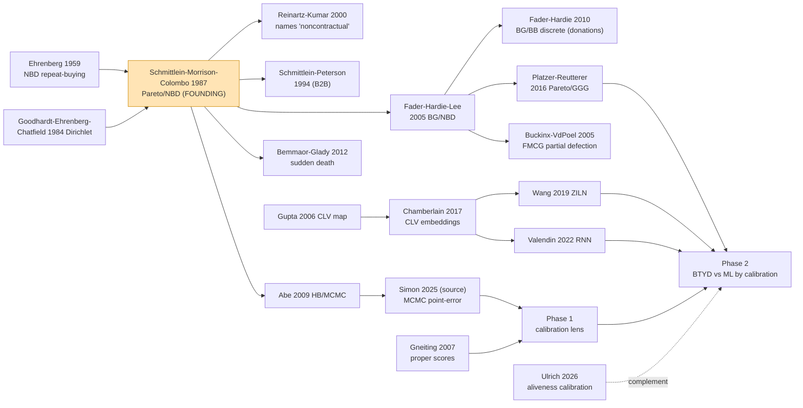

# From the origin of the field to today

> **Scope.** This traces the intellectual lineage of **non-contractual customer churn** —
> the problem of forecasting a customer base when *dropout is never observed*. It is the
> historical foundation the living tracker (2023+) sits on top of. Papers named here are
> seeds of the citation tree; the full ~N-paper repository lives in the tracker DB
> (`source='genealogy'`) and the year-by-year progression in
> [`HISTORICAL_PROGRESSION.md`](HISTORICAL_PROGRESSION.md).

## 0. Two words, two lineages: "churn" vs "customer death"

The field has **two origins that only later merged**:

1. **"Churn"** as a word is a **telecom/contractual** coinage of the **1990s** — the rate
   at which subscribers cancel a *contract*. That lineage is a **survival / classification**
   problem (the cancellation is a dated, observed event) and produced the vast
   ML-churn-prediction literature (telecom/UCI datasets), surveyed by Manzoor et al.
   (2024) and Imani et al. (2025). **It is not where our field starts.**

2. **"Customer death" / latent attrition** in a **non-contractual** setting — the customer
   who simply stops buying, with no cancellation to observe — is the lineage we care
   about. Its statistical bedrock predates the word "churn" by decades, and its defining
   paper is **Schmittlein, Morrison & Colombo (1987)**.

The two lineages stayed **siloed** for ~30 years — a documented finding of this project:
the churn-ML field reviews cite **zero** BTYD/Pareto-NBD work (LITERATURE_MATRIX §1). Our
manuscript is one of the works bridging them (BTYD *vs* ML, judged by calibration).

---

## 1. Pre-history — repeat-buying statistics (1959–1984)

Before anyone modelled *dropout*, they modelled *repeat purchasing*.

- **Ehrenberg (1959), "The Pattern of Consumer Purchases"** — fits the **Negative
  Binomial Distribution (NBD)** to how many times consumers buy a product in a period.
  The NBD = Poisson purchasing with **Gamma-distributed heterogeneity** across customers.
  This Poisson-Gamma mixture is the *exact* purchasing half of every BTYD model that
  followed. **This is the true origin of the statistical machinery.**
- **Ehrenberg, *Repeat-Buying* (1972; 2nd ed. 1988)** — consolidates the NBD program into
  an empirical law of buyer behaviour.
- **Goodhardt, Ehrenberg & Chatfield (1984), the NBD-Dirichlet** — extends NBD to brand
  choice across a category; the "Dirichlet" becomes marketing science's canonical
  stationary buying model.

What was **missing**: all of these assume customers stay alive. None model the customer
who **quietly leaves**. That is the gap 1987 fills.

---

## 2. The founding paper — latent attrition (1987)

**Schmittlein, Morrison & Colombo (1987), "Counting Your Customers: Who Are They and What
Will They Do Next?", *Management Science* 33(1).**

This is **the origin of non-contractual churn modelling.** It introduces the
**Pareto/NBD**:

- purchasing while alive = **Poisson–Gamma (NBD)** — inherited from Ehrenberg;
- lifetime until an **unobserved** dropout = **exponential–Gamma (Pareto Type II)**;
- from just **recency (last purchase) and frequency (count)** it computes **P(alive)** and
  **expected future transactions** — inferring a death that is never seen.

Every model in this project descends from it. It is seed #1 of the citation tree, and its
forward-citation graph (600+ works) is the field itself.

**Terminology note.** The explicit adjective **"noncontractual"** enters the title of the
literature with **Reinartz & Kumar (2000), "On the Profitability of Long-Life Customers in
a Noncontractual Setting" (*J. Marketing*)** — which also punctures the "loyalty = profit"
assumption and cements the non-contractual framing as a named research setting.

---

## 3. Consolidation & the first B2B / applied extensions (1988–2004)

- **Schmittlein & Peterson (1994)** — first **industrial / B2B** application (customer base
  analysis for an industrial-purchase process).
- **Reinartz & Kumar (2000, 2003)** — non-contractual **profitability** and lifetime
  duration; names the setting.
- **CLV terrain, 2004** — **Gupta, Lehmann & Stuart, "Valuing Customers"**; **Venkatesan &
  Kumar**, a CLV framework for resource allocation; **Rust, Lemon & Zeithaml**, customer
  equity / return on marketing. Customer-base analysis becomes a management-science
  cornerstone.

---

## 4. The BTYD boom — variants, heuristics, validation (2005–2016)

The model family the acronym **BTYD ("buy till you die")** now names.

- **2005 — Fader, Hardie & Lee, BG/NBD** ("Counting Your Customers the Easy Way"):
  replaces Pareto dropout with a **Beta-Geometric** dropout that only fires **after a
  purchase**, giving a closed form that spread the model to practitioners. Same year,
  their **RFM & CLV iso-value curves** connect BTYD to the old RFM heuristics.
- **2005 — Buckinx & Van den Poel** — the canonical **non-contractual FMCG partial
  defection** paper; the machine-learning-flavoured churn-classification branch *inside*
  the non-contractual world.
- **2001/2006 — Fader & Hardie CDNOW case; Gupta et al. "Modeling CLV" survey** — the
  benchmark dataset and the field's first map.
- **2007–2008 — validation & heuristics:** Batislam et al. empirically compare models;
  **Wübben & von Wangenheim (2008)** show simple **heuristics often match** Pareto/NBD —
  the accuracy-only evaluation tradition our paper critiques.
- **2009 — Abe, HB Pareto/NBD** — a **hierarchical Bayes / MCMC** estimator (covariates,
  individual draws); the estimation backbone Simon (2025) and we build on.
- **2010 — Fader & Hardie, BG/BB** — **discrete-time** non-contractual model, the
  canonical **donations** setting.
- **2011 — Jerath, Fader & Hardie** — periodic-death generalization.
- **2012 — Bemmaor & Glady (Gamma/Gompertz "sudden death"); Miguéis et al. (partial
  churn).**
- **2016 — Platzer & Reutterer, Pareto/GGG** — adds **regularity of inter-purchase timing**
  (Gamma timing), the structural timing repair our §6.8 uses.

By 2016 the *statistical* family is essentially complete; evaluation is still **point
error** (MAE/MAPE/correlation), never calibration.

---

## 5. The ML turn (2017–2024)

Machine learning enters CLV/churn forecasting:

- **2017 — Chamberlain et al. (KDD), CLV via embeddings** — deep features for CLV.
- **2019 — Wang, Liu & Miao (Google), ZILN** — a **zero-inflated lognormal** deep model
  for CLV; predicts a distribution but checks it only with **decile reliability charts +
  Gini**, not PIT/CRPS/coverage.
- **2022 — Valendin et al. (IJRM), RNN customer-base analysis** — the closest head-to-head
  **ML-vs-BTYD** benchmark; still evaluated by RMSE/MAPE/lift.
- **2024 — De Caigny et al.; field reviews (Manzoor et al.); ChurnNet; ViT/ensemble churn**
  — the churn-ML literature matures, but on **contractual telecom/UCI** data and
  **classification metrics** (AUC/F1/EMP-profit), and it **does not cite BTYD**.

---

## 6. The calibration frontier & the present (2007-tools → 2025–2026)

The evaluation tools that reframe the problem:

- **Gneiting & Raftery (2007), proper scoring rules; Gneiting, Balabdaoui & Raftery
  (2007), calibration + sharpness; Czado, Gneiting & Held (2009), randomized PIT for
  counts; Guo et al. (2017), NN calibration/ECE; Kuleshov et al. (2018), calibrated
  regression.** These are the instruments our paper turns on customer forecasts.
- **2025 — Simon, "A generalised comparison of Pareto/NBD based forecasts using MCMC"
  (JBE)** — our **source paper**; compares MCMC vs MLE vs heuristics by **point error**.
- **2026 — Ulrich, "Dead Reckoning"** — **first to score BTYD aliveness calibration**
  (Brier/CORP/ECE), but **BTYD-only, no ML** — concurrent complement, not competitor.
- **Ours (Phase 1 → Phase 2)** — reframes customer-base forecasting as a **probability-
  calibration** problem and runs the **first BTYD-vs-ML comparison judged by calibration**
  (PIT/CRPS/coverage) across seven non-contractual cohorts.

---

## 7. The lineage in one picture

---

## 8. Coverage check — is the origin covered?

> **Built 2026-09-20.** The citation tree is **3,043 papers / 20,457 edges spanning
> 1959→2026** (a few stray refs reach back to the 1800s), ingested into `tracker.db`
> (`source='genealogy'`). Of these, **1,049 are on-topic** (relevance ≥ 2) and **69 are
> explicitly BTYD/customer-base**. The triage funnel sifts them into **A = 127 (read) ·
> B = 694 (scan) · C = 230 (reference) · D = 1,992 (tools/off-topic)** — see
> [`CORE_READING_LIST.md`](CORE_READING_LIST.md) (the Tier-A spine), the full audit trail
> `research-paper-tracker/data/out/genealogy_triage.csv`, and the year-by-year
> [`HISTORICAL_PROGRESSION.md`](HISTORICAL_PROGRESSION.md). Method + reproduce:
> [`research-paper-tracker/tools/genealogy/README.md`](../research-paper-tracker/tools/genealogy/README.md).
>
> **The origin is covered — and the tree surfaced spine papers the manuscript corpus did
> not have**, e.g. Anscombe (1950, NBD sampling theory — the statistical root), Morrison
> (1969/1981) and Schmittlein (1983, 1985) NBD precursors, Guadagni & Little (1983, logit
> brand choice), Dew (2018, Bayesian nonparametric CBA), Bachmann et al. (2021, time-varying
> latent attrition), and **Xie (2020), "Pareto/NBD versus neural network"** — a direct
> BTYD-vs-ML comparison that **must be read and screened against the novelty claim**
> (its `calib` tag likely refers to the *calibration period* / estimation window, not
> probability calibration — verify before relying on it; cf. the same distinction drawn
> for Valendin in LITERATURE_MATRIX §2b). These are Tier-A/B candidates to triage into the
> manuscript's Related Work — the first concrete payoff of the genealogy sweep.

| Era / branch | Founding work | In corpus? | In tracker DB? | Notes |
|---|---|---|---|---|
| Repeat-buying pre-history | Ehrenberg 1959 NBD | seed | ✅ genealogy | *was absent from the 2023+ tracker; now ingested* |
| Founding paper | Schmittlein-Morrison-Colombo 1987 | seed | ✅ genealogy | root of the forward-citation graph |
| "Noncontractual" named | Reinartz-Kumar 2000 | seed | ✅ genealogy | |
| B2B application | Schmittlein-Peterson 1994 | seed | ✅ genealogy | |
| BG/NBD | Fader-Hardie-Lee 2005 | seed | ✅ | |
| Discrete-time / donations | Fader-Hardie 2010 BG/BB | seed | ✅ | |
| HB/MCMC | Abe 2009 | seed | ✅ | |
| Timing repair | Platzer-Reutterer 2016 | seed | ✅ | |
| Non-contractual churn classification | Buckinx-VdPoel 2005 | seed | ✅ | |
| ML-CLV | Wang 2019 / Valendin 2022 | seed | ✅ | |
| Calibration tools | Gneiting 2007 etc. | seed | ✅ | |
| Source / concurrent | Simon 2025 / Ulrich 2026 | seed | ✅ | |

> **Headline:** the field's pre-2023 origins were *documented* in `deep_research/` but were
> **not in the tracker** (which floored at 2023). The genealogy build lowers that floor and
> ingests the full citation tree, so `tracker.db` is now the single corpus **from Ehrenberg
> (1959) to the live 2023+ monitor**. Per-industry coverage is in
> [`INDUSTRIES_NONCONTRACTUAL.md`](INDUSTRIES_NONCONTRACTUAL.md) §"Why this matters".
