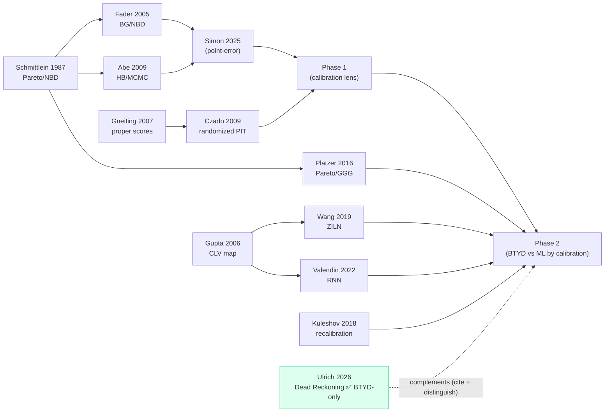

# Literature Matrix — Non-contractual churn (Phase 1 & 2)

> **Status:** scaffolded 2026-08-03 from the organized library. The *structural* columns (paper,
> venue, role, reading-order location) are filled; the *deep-read* columns (**Calib?**, datasets,
> limitation) are pre-filled **provisionally** where our own manuscript or a known abstract implies
> the answer (marked **†**) and left **❓** otherwise. Confirm the **†** and **❓** cells during the
> Stage-1 read ([`deep_dive.md`](deep_dive.md)), then drop the **†**.

## How to use
One row per paper. The single most important column is **Calib?** — *does this paper evaluate its
forecasts by calibration* (PIT / CRPS / coverage / ECE)? Our headline novelty claim is that we are the
first to compare BTYD-vs-ML **by calibration**, so every ❌ strengthens it and every ✅ is a paper we
must cite and distinguish. Keep §1 (the scoreboard) in sync with the table.

**Legend — Calib?**
| Mark | Meaning | Effect on our novelty claim |
|---|---|---|
| ❌ | point-error / accuracy only, no calibration | **supports it** |
| ⚠️ | predicts a distribution but never tests its calibration | mostly supports; note it |
| ✅ | evaluates calibration (PIT/CRPS/coverage/ECE) on customer forecasts | **threatens it — cite & distinguish** |
| 🔬 | calibration *methodology* paper (not customer forecasting) | n/a — these are the tools we use |
| ❓ | not yet determined | verify in deep read |
| † | value is provisional (inferred, not yet confirmed by reading) | |

**Other columns:** **Read** ☐/☑ · **Loc** = where it sits in the reading order · **Pri** = deep-read
priority (🔴 high / 🟡 med / ⚪ low).

---

## 1. Novelty-defense scoreboard  *(the headline rollup — keep current)*

The claim survives iff **no customer-forecasting paper evaluates by calibration** before us. Tally of
the papers that actually *compete* on that ground (ML-for-CLV/forecasting + churn-classification +
BTYD comparators — the 🔴/🟡 rows below):

| Calib? verdict | # papers (read-confirmed) | So far |
|---|---|---|
| ❌ point-error / accuracy only | **9** — Simon (2025), Valendin (2022), De Caigny (2024), Coolwijk (2024), Wachwanakijkul (2024), ChurnNet (2026), Mufti (2026), Leoni–Perego (2022), Sci Rep (2024) | **each strengthens the claim** |
| ⚠️ predicts a distribution, not *distributionally* calibrated | **1** — Wang ZILN (2019): decile charts (predicted-vs-actual LTV) + normalized Gini only; no PIT/CRPS/coverage | supports; noted precisely |
| ✅ evaluates calibration | **1** — Ulrich (2026), **BTYD-only, no ML, concurrent** | **ML-scoped claim holds** |
| 🔬 review/tool (no customer-forecast calibration) | **2** — Imani (2025), Manzoor (2024) | **strengthens (see below)** |
| ❓ still to check | core BTYD rows only (2a) — not competitors | low risk; all point-error by construction |

> **Verdict (2026-08-10 read pass): the novelty claim stands.** Across every direct competitor and
> every recent churn paper in the library, **none** evaluates customer forecasts by probability
> calibration (PIT/CRPS/coverage/ECE). The single calibration-scoring paper (Ulrich 2026) is
> **BTYD-only and declines the ML horse race**, so the *BTYD-vs-ML-by-calibration* ground is
> uncontested. Wang ZILN is the closest any ML competitor comes and it is only a **qualitative decile
> calibration chart** of the mean, not a test of the predictive distribution.
>
> **Killer corroboration — the two field reviews cover neither BTYD nor calibration.** Full-text
> search of Imani (2025) and Manzoor (2024) — surveying ~240 and 212 studies respectively — returns
> **0** hits for `Pareto/NBD`, `buy-till-you-die`, `BTYD`, `Schmittlein`, `Fader`, **and 0 for
> `calibration`**. The churn-ML literature and the CBA/BTYD forecasting tradition are siloed: their own
> systematic reviews do not cite the structural family we benchmark, nor raise the calibration lens.
> This is the strongest single piece of novelty-defense evidence — ready to fold into §1/Related Work.

> **Live-literature confirmation (2026-08-11).** The OpenAlex forward-citation + topical monitor
> (`openalex_monitor.py`, ~90 works citing our six seeds, 2023+) found **0 works evaluating BTYD-vs-ML
> by calibration** — the claim now holds against the *live* graph, not just the local library. No India
> non-contractual transaction dataset surfaced (F8 still open). See [`deep_dive.md`](deep_dive.md) §8.

> **Decision rule:** the first ✅ in an *ML* customer-forecasting paper forces an edit to the novelty
> sentence (`manuscript_phase2.tex` §1, contributions). None found. **Read Ulrich first.** ✅ done.
>
> **Ulrich (2026) — read 2026-08-10 — ✅ scores calibration, but the claim survives.** He grades
> **BTYD aliveness** calibration (Brier / CORP reliability / ECE / AUC, out-of-time (v,H) grid) and
> claims "first to score the probability calibration of BTYD-implied aliveness quantities." **He does
> *not* score ML** (explicitly declines the horse race, p.27) and is churn-only (no value, no timing).
> Our §1 claim is already scoped to **BTYD *vs ML* by calibration across all four targets** (l.169–173),
> so it does **not** need retraction — only a citation + one distinguishing clause, and a citation on
> the churn target where his work is concurrent. Full verdict in [`deep_dive.md`](deep_dive.md) §8.
> **Net effect on the scoreboard:** the ML-vs-BTYD calibration ground is still uncontested; the
> BTYD-aliveness-calibration ground is now shared with Ulrich (concurrent), and we cite him there.

---

## 2. The matrix

> **📄 Deep-dive series (2026-08-11).** Eight papers we position against now have a full standalone
> deep-dive (what it does · novelty · how it differs from ours · how we use it · verdict), indexed in
> [`deep_dive.md`](deep_dive.md): Ulrich (2026) `ulrich_deep_dive.md`, Simon (2025) `simon2025_deep_dive.md`,
> Valendin (2022) `valendin2022_deep_dive.md`, Wang (2019) `wang2019_deep_dive.md`,
> Platzer (2016) `platzer2016_deep_dive.md`, Fader (2005) `fader2005_deep_dive.md`,
> Manzoor (2024) `manzoor2024_deep_dive.md`, Imani (2025) `imani2025_deep_dive.md`. The 🔴/🟡 competitor,
> foundation, and review rows below are the ones covered; tool rows (🔬) are covered in
> [`corpus_critique.md`](corpus_critique.md) §4.

### 2a. BTYD / customer-base foundations
| Paper | Yr | Venue | Role in our argument | Calib? | Read | Loc | Pri |
|---|---|---|---|---|---|---|---|
| Schmittlein, Morrison & Colombo | 1987 | Mgmt Sci | the Pareto/NBD model we study | ❌† | ☐ | — | 🟡 |
| Fader, Hardie & Lee (BG/NBD) | 2005 | Mktg Sci | the variant we show is immaterial | ❌† | ☐ | P1·9 | 🟡 |
| Fader & Hardie (discrete-time) | 2010 | Mktg Sci | modelling-style consolidation | ❌† | ☐ | P1·10 | ⚪ |
| Fader & Hardie (CDNOW case) | 2001 | Interfaces | the CDNow benchmark | ❌† | ☐ | P1·13 | ⚪ |
| Platzer & Reutterer (Pareto/GGG) | 2016 | Mktg Sci | the structural timing repair (§6.8) | ❌† | ☐ | P1·17 / P2·19 | 🔴 |
| Abe (HB Pareto/NBD) | 2009 | Mktg Sci | the MCMC sampler | ❌† | ☐ | P1·19 | 🟡 |
| **Simon (our source paper)** | 2025 | J Bus Econ | the paper we extend; **evaluates point error** | ❌ | ☑ | P1·14 | 🔴 |
| Simon & Adler | 2022 | working | small-sample parameter recovery | ❌† | ☐ | P1·15 | ⚪ |
| McCarthy & Wadsworth (walkthrough) | 2014 | BTYD pkg | hands-on orientation | 🔬† | ☐ | P1·3 | ⚪ |
| point-error comparison tradition¹ | '00–'12 | various | the tradition we critique | ❌† | ☐ | P1·6–12 | ⚪ |

¹ Batislam et al. (2007); Wübben & von Wangenheim (2008); Huang (2012); Bemmaor & Glady (2012); Reinartz & Kumar (2000).

### 2b. ML for CLV & customer forecasting  *(the direct competitors)*
| Paper | Yr | Venue | Role in our argument | Calib? | Read | Loc | Pri |
|---|---|---|---|---|---|---|---|
| Gupta et al. (Modeling CLV) | 2006 | J Svc Res | maps the CLV terrain | ❌† | ☐ | P2·5 | 🟡 |
| Chamberlain et al. (embeddings) | 2017 | KDD | ML-CLV counterpoint to BTYD | ❌† | ☐ | P2·6 | 🟡 |
| **Wang, Liu & Miao (ZILN)** | 2019 | arXiv | our value comparator (§6.6) | ⚠️ *(decile charts + norm. Gini; no PIT/CRPS/coverage — mean reliability, not distributional)* | ☑ | P2·8 | 🔴 |
| **Valendin et al. (RNN CBA)** | 2022 | IJRM | closest ML-vs-BTYD benchmark (§2.2) | ❌ *(RMSE/MAPE/MAE/lift; all 45 "calibrat" = estimation window)* | ☑ | P2·9 | 🔴 |
| Cranmer et al. (SBI) | 2020 | PNAS | background for amortized estimator | 🔬† | ☐ | P2·7 | ⚪ |

### 2c. Non-contractual churn (classification)
| Paper | Yr | Venue | Role in our argument | Calib? | Read | Loc | Pri |
|---|---|---|---|---|---|---|---|
| **Buckinx & Van den Poel** | 2005 | EJOR | canonical non-contractual churn (cited, v2.0.2) | ❌† | ☐ | P2·3 | 🟡 |
| Miguéis et al. (partial churn) | 2012 | ESwA | partial/behavioural churn (cited, v2.0.2) | ❌† | ☐ | P2·4 | 🟡 |
| De Caigny, De Bock & Verboven | 2024 | DSS | hybrid black-box churn (**cited v2.0.3**, XAI ¶) | ❌ *(AUC/lift/EMP-profit + SHAP interpretability)* | ☑ | P2·appx | 🟡 |
| Coolwijk et al. (ViT) | 2024 | — | radar-chart image churn | ❌ *(F1/accuracy/precision/recall/confusion)* | ☑ | P2·appx | ⚪ |
| Wachwanakijkul et al. (car-sharing) | 2024 | — | non-contractual mobility churn | ❌ *(AUC/F1/accuracy)* | ☑ | P2·appx | ⚪ |
| Boukrouh & Azmani (explainable) | 2025 | IJ-AI | e-commerce churn, XAI (**cited v2.0.3**, XAI ¶) | ❌ *(accuracy/precision/recall/F1 + SHAP/LIME)* | ☑ | P2·appx | ⚪ |
| ChurnNet (Saif, Maggiore, Russo & Distante) | 2026 | arXiv | recent optimized churn model (**cited v2.0.3**, RW) | ❌ *(accuracy/precision/recall/F1/AUC; conventional ML beats deep UniTS)* | ☑ | P2·appx | ⚪ |
| Mufti et al. (rolling-window) | 2026 | arXiv | rolling-window churn labelling | ❌ *(AUC/ROC/F1/accuracy)* | ☑ | P2·appx | ⚪ |

### 2d. Probabilistic forecast evaluation & recalibration  *(our tools)*
| Paper | Yr | Venue | Role in our argument | Calib? | Read | Loc | Pri |
|---|---|---|---|---|---|---|---|
| Gneiting & Raftery (proper scores) | 2007 | JASA | CRPS / log score foundation | 🔬 | ☐ | P2·14 | 🟡 |
| Gneiting, Balabdaoui & Raftery | 2007 | JRSS-B | sharpness-subject-to-calibration | 🔬 | ☐ | P2·13 | 🟡 |
| Czado, Gneiting & Held | 2009 | Biometrics | randomized PIT for counts | 🔬 | ☐ | P2·15 | 🟡 |
| Guo et al. (NN calibration) | 2017 | ICML | ECE / reliability for churn (§6.7) | 🔬 | ☐ | P2·16 | ⚪ |
| Kuleshov, Fenner & Ermon | 2018 | ICML | isotonic recal → conformalized BTYD | 🔬 | ☐ | P2·17 | 🟡 |
| Lilliefors | 1967 | JASA | bootstrap PIT-KS null (App. A) | 🔬 | ☐ | P2·18 | ⚪ |

### 2e. Statistical / ML machinery  *(supporting; low priority)*
Friedman (2001, GBM) · Koenker & Bassett (1978, quantiles) · Pedregosa et al. (2011, sklearn) ·
Tanner & Wong (1987) · Neal (2003, slice) · Vehtari et al. (2021, R̂) · Benjamini & Hochberg (1995) ·
Schuirmann (1987, TOST) · Dawid (1984). — all 🔬, ⚪ priority; confirm we cite each correctly.

### 2f. Candidates — new, un-triaged  *(read these first)*
| Paper | Yr | Venue | Why it matters | Calib? | Read | Pri |
|---|---|---|---|---|---|---|
| ⭐ **Ulrich — *Dead Reckoning*** | 2026 | Wharton wp (arXiv:2607.18623) | BTYD aliveness-calibration + partial-ID; **complement — cite & distinguish**; **folded into v2.0.3** | ✅ BTYD-only | ☑ 2026-08-10 | 🔴 |
| Imani et al. (systematic review) | 2025 | MDPI (make7030105) | field survey (**cited v2.0.3**); **0 BTYD, 0 calibration**; telecom-dominated; flags profit/XAI/drift gaps | 🔬 | ☑ 2026-08-10 | 🔴 |
| TU Dublin = Manzoor et al. (ML churn review) | 2024 | IEEE Access 12 | field survey (**cited v2.0.3**); **0 BTYD, 0 calibration**; profit-metric lineage | 🔬 | ☑ 2026-08-10 | 🟡 |
| Leoni & Perego (thesis) | 2022 | PoliMi MSc | non-contractual retail churn, transactional + private-label features | ❌ *(recall/profit; calibrat=0)* — **discard / optional** | ☑ 2026-08-10 | ⚪ |
| Sci. Reports (ensemble-fusion) | 2024 | Sci Rep | recent ML churn method (telecom) | ❌ *(AUC/ROC/F1/accuracy; calibrat=0)* — **discard** | ☑ 2026-08-10 | ⚪ |

---

## 3. Datasets index  *(feeds the open F8 India-dataset gap)*

Fill each paper's dataset(s) during the read; this shows the field's coverage vs. our seven cohorts.

| Dataset | Used by | In our study? |
|---|---|---|
| CDNOW | Fader & Hardie (2001); Simon (2025); us | ✅ |
| Online Retail / II | many; us | ✅ |
| Grocery / Dunnhumby / Ta-Feng / Olist | us | ✅ |
| Telecom (IBM/Kaggle, UCI) — **contractual** | the ML-churn field: Imani, Sci Rep, Manzoor, De Caigny, Coolwijk, ChurnNet, Mufti | n/a (contractual; out of scope by design) |
| Kaggle e-commerce churn (India) | *(search — F8)* | ❌ **open** |

> **F8 — reviewed 2026-08-10, still open.** Mining the two review bibliographies did **not** surface an
> India non-contractual **transaction-level** dataset: Imani's three "India" hits are all *conference
> locations* (ICICV Tirunelveli, ICSCAN Pondicherry, ICWITE Bangalore), not datasets. The ML-churn
> field is overwhelmingly **telecom/UCI (contractual)** — which actually sharpens our contribution
> (seven genuinely non-contractual **transaction logs** vs a telecom-dominated field). F8 remains a
> user decision; the OpenAlex topical India search (`deep_dive.md` §4) is the remaining automated lead.

## 4. Reading progress
- **Candidates: 5 / 5 read** (2026-08-10) — Ulrich (full), Manzoor/TU Dublin (§VI + Appendix; crosswalk
  in [`gap_crosswalk_manzoor2024.md`](gap_crosswalk_manzoor2024.md)), Imani (full-text scan), Leoni–Perego,
  Sci Reports. Verdicts: 2 field surveys cited (Manzoor, Imani); 3 point-error churn papers (discard/optional).
- **Appendix: 6 / 6 scanned** (2026-08-10) — De Caigny, Coolwijk, Wachwanakijkul, Boukrouh, ChurnNet,
  Mufti; all ❌ (classification/profit metrics, no calibration). Three now cited in v2.0.3 (De Caigny,
  Boukrouh, ChurnNet).
- **Direct competitors confirmed:** Valendin (2022) ❌ and Wang ZILN (2019) ⚠️ read for the Calib? column.
- Core BTYD foundations (2a): still provisional (❌†) — all point-error by construction; low risk, deep
  read deferred. Reading method: full-text term scan (`scratchpad/scan_lit.py`) for the Calib? verdict,
  targeted context reads for nuance.

## 5. To-chase  *(papers cited by our references that we don't have yet)*
- **Nothing must-cite surfaced.** The read pass produced no new calibration-evaluating customer-forecast
  paper (the only novelty threat) — the search space is now well covered.
- Minor CLV-evaluation refs seen in Wang (2019): Donkers et al. (2007) hit-rate, Malthouse & Blattberg
  (2005) — optional, only if we expand the value-evaluation discussion.
- **Structural finding (not a chase — a positioning point):** the two field reviews (Imani, Manzoor)
  cite **no** BTYD/Pareto-NBD work at all → the churn-ML and CBA literatures are siloed; strong material
  for the §1/Related-Work novelty defense.

## 6. Citation lineage

---
*Companion to [`deep_dive.md`](deep_dive.md). Loc codes: `P1·n` / `P2·n` = item n in
[`../references/READING_ORDER.md`](../references/READING_ORDER.md) /
[`READING_ORDER_PHASE2.md`](../references/READING_ORDER_PHASE2.md); `appx` = Phase 2 appendix.*
