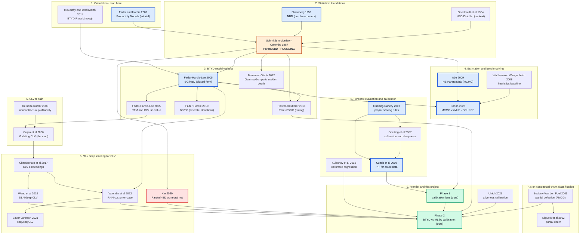
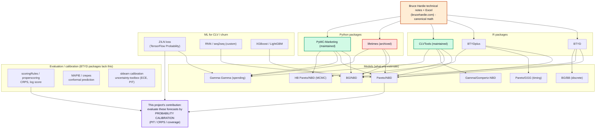

# What to read, in what order — and what tools people use

You do **not** read 127 papers. This splits into two views, kept deliberately separate:

- **§3 the reading path** — ~30 *papers* wired by "read-X-before-Y", with an 8-paper
  critical path (`reading_path.mmd`).
- **§4 the tooling map** — the *code / packages / solutions*, mapped to the models they
  implement (`tooling_map.mmd`).

---

## 1. Tools, packages & solutions people actually use

The field has mature, standard implementations — you rarely code a Pareto/NBD from scratch.

### R (the field's native habitat — most models originate here)
| Package | What it gives you | Notes |
|---|---|---|
| **`BTYD`** | Pareto/NBD, BG/NBD, BG/BB | the original CRAN package (Dwyer, Wadsworth et al.); paired with McCarthy & Wadsworth's walkthrough |
| **`BTYDplus`** (Platzer 2021) | MBG/NBD, MBG/CNBD-*k*, **Pareto/GGG**, Pareto/NBD (Abe HB) | the research-grade superset; timing-regularity + HB models live here |
| **`CLVTools`** | Pareto/NBD, BG/NBD, GGompertz/NBD, **Gamma-Gamma spending**, time-varying covariates | actively maintained (Bachmann, Meierer, Näf); the modern go-to for applied CLV in R |

### Python
| Package | What it gives you | Notes |
|---|---|---|
| **`lifetimes`** (Davidson-Pilon) | BG/NBD, Pareto/NBD, MBG/NBD, Gamma-Gamma | *the* classic Python BTYD lib — **now unmaintained/archived**; huge install base |
| **`PyMC-Marketing`** (CLV module) | BG/NBD, Pareto/NBD, Gamma-Gamma, Shifted-Beta-Geo, **full Bayesian/MCMC** | the maintained **successor** to `lifetimes` (PyMC Labs); covariates + posterior uncertainty |

### Reference math
- **Bruce Hardie's technical notes + Excel spreadsheets** (brucehardie.com) — the canonical,
  citable derivations for BG/NBD, Pareto/NBD, BG/BB, Gamma-Gamma. Most packages implement
  these notes. **Start here for the equations.**

### Evaluation / calibration (this project's toolkit — the lens the BTYD packages *don't* give you)
| Tool | Use |
|---|---|
| **`scoringRules`** (R) / **`properscoring`** (Python) | CRPS, log score, proper scoring rules |
| **`uncertainty-toolbox`**, sklearn `calibration`, **`MAPIE`/`crepes`** (conformal) | reliability, ECE, PIT, calibrated/conformal prediction |

### ML / DL for CLV & churn
- **ZILN** (zero-inflated lognormal) loss — Wang et al. 2019, in TensorFlow Probability.
- **RNN / seq2seq** customer-base models — Valendin 2022, Bauer & Jannach 2021 (custom).
- **Gradient boosting** (XGBoost / LightGBM) — the workhorse for churn *classification*.

> **The gap this project fills:** BTYD packages give you *forecasts*; ML libs give you
> *point accuracy*; **none** ship a *probability-calibration* evaluation of customer
> forecasts. That is the manuscript's contribution (the purple node in §4).

---

## 2. The critical path — read these 8, in order

If you read nothing else, read this spine top-to-bottom:

1. **Fader & Hardie (2009), "Probability Models for Customer-Base Analysis"** — the tutorial. Orientation.
2. **Ehrenberg (1959), NBD** — why purchasing = Poisson-Gamma. The statistical root.
3. **Schmittlein, Morrison & Colombo (1987), Pareto/NBD** — the founding paper: latent (unobserved) dropout.
4. **Fader, Hardie & Lee (2005), BG/NBD** — the closed-form variant that put it in every toolkit.
5. **Abe (2009), HB Pareto/NBD** — how it's estimated by MCMC (+ covariates).
6. **Simon (2025)** — the source paper you extend: MCMC vs MLE vs heuristics.
7. **Gneiting & Raftery (2007) + Czado, Gneiting & Held (2009)** — proper scoring rules & PIT: the evaluation lens.
8. **Phase 1 → Phase 2 (this project)** — the calibration reframing, then BTYD-vs-ML by calibration.

Everything else deepens one branch of this spine.

---

## 3. Reading diagram — *papers only* (`reading_path.mmd`)

Edges mean **"read the source before the target"**. Bold blue = the 8-paper critical path;
orange = the founding paper; green = this project; red = screen against the novelty claim.

---

## 4. Tooling map — *code / packages* (`tooling_map.mmd`)

Which package implements which model, and where the evaluation/ML stack sits. Green =
maintained; red = archived (`lifetimes`); orange = the reference math; purple = the gap
this project fills.

---

## 5. Per-track order (with the one-line "why")

- **① Orientation:** FH09 tutorial → (Hardie notes for the math) → MC14 for hands-on R.
- **② Foundations:** EHR59 (why Poisson-Gamma) → SMC87 (latent dropout — the whole idea).
- **③ Variants:** BG/NBD (easy) → then pick by need: BG/BB (discrete/donations), Pareto/GGG
  (timing), Gamma/Gompertz (flexible dropout); RFM05 adds the Gamma-Gamma **spending** model.
- **④ Estimation:** ABE09 (MCMC) + WUB08 (the heuristics baseline you must beat) → SIM25 (source).
- **⑤ CLV terrain:** RK00 (noncontractual profitability myth-busting) → GUP06 (the field map).
- **⑥ ML:** CHA17 → WANG19 (ZILN) / VAL22 (RNN, the closest ML-vs-BTYD) → BAU21; **screen XIE20**.
- **⑦ Churn classification:** BUCK05 (canonical non-contractual) → MIG12.
- **⑧ Calibration lens:** GR07 → GBR07 → CGH09 (PIT for counts) → KUL18 (recalibration).
- **⑨ Frontier/ours:** ULR26 (BTYD aliveness calibration, concurrent) → Phase 1 (reframing)
  → Phase 2 (BTYD vs ML by calibration).

> Depth control: the **critical path (§2)** is the trunk; each numbered track is a branch you
> read only as deep as your question needs. The other ~600 Tier-B papers
> (`genealogy_triage.csv`) are for citation-chasing, not cover-to-cover reading.
