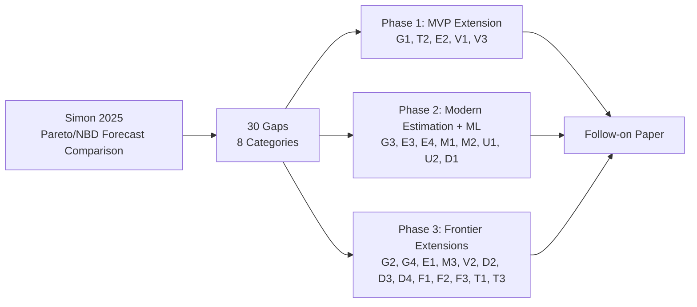

# Extending Simon (2025): Research Gap Analysis & Study Design

## Document Purpose

This is a planning artifact, not a draft of the paper itself — the same role your other `PROJECT_SPEC.md` files play. It inventories every gap, weakness, and unexplored extension in Lydia Simon's 2025 *Journal of Business Economics* paper, then turns that inventory into a phased, executable study design for a follow-on paper. Everything downstream (Sections 4–11) is built directly off the gap IDs defined in Section 3, so you can cite them by ID (`G1`, `T2`, etc.) when writing or when handing pieces of this off for implementation.

---

## 0. Source Paper at a Glance

**Citation:** Simon, L. (2025). *A generalised comparison of Pareto/NBD based forecasts using MCMC, maximum likelihood, and heuristics.* Journal of Business Economics, 95:1079–1105.

**What it does:** Compares MCMC (Abe 2009's data-augmented sampler, via `BTYDplus`), MLE (via `CLVTools`), and a management heuristic (Wübben & Wangenheim 2008) across four forecasting tasks for the *classical* (independence-assuming) Pareto/NBD model: (1) individual future purchase count, (2) active-customer identification, (3) Top A% customer identification, (4) timing of the next purchase. Validated on 3,000 simulated datasets + 4 empirical datasets (CDNow, Grocery, Gusto, Homeshopping).

**Core finding:** Parametric models (MLE and MCMC both) beat the heuristic on tasks 1–3 — contradicting earlier literature that favored heuristics. MCMC edges out MLE, mostly because it can assign exact-zero forecasts to latent dropouts. Timing-of-next-purchase (task 4) is unusable in practice regardless of method (≤60% of active customers forecast within 4 weeks).

**Code:** publicly available at `https://github.com/PNBDForecast/PNBD-Forecast` (per the paper's data-availability statement).

---

## 1. Practical Constraints: Data & Reproducibility

> [!warning] Read this before scoping anything else
> The paper's own data-availability statement is explicit: the **simulated datasets are not shared** (only the code to regenerate them), and the **real datasets are available on request only** — Gusto and Homeshopping are proprietary, and Grocery's status (used earlier by Platzer & Reutterer 2016) is also unclear. Only **CDNow** is a genuinely standard, independently-public benchmark (it's hosted separately as the field's default benchmark and used in dozens of other papers, independent of Simon's repo).
>
> Practical implication: you cannot fully replicate Simon's *exact* empirical validation without either (a) emailing the author for the Gusto/Homeshopping data, or (b) substituting your own public non-contractual transaction datasets for D4 (Section 3.6). Plan for (b) unless you specifically want exact replication.

The simulation engine itself is fully reproducible from the public code, which is the good news — most of the extensions below (new model families, new estimation methods, extended parameter grids) only require the simulation arm, not the proprietary empirical datasets.

---

## 2. Positioning Statement

This isn't a rebuttal paper. Simon (2025) is methodologically careful and explicitly scopes itself to the classical, covariate-free, independence-assuming Pareto/NBD — and says so. The gaps below are mostly gaps she names herself as out of scope ("left for further research," "not in the scope of this study") plus a smaller set of things the paper asserts but never tests (bootstrap CI quality, independence-assumption robustness, MCMC convergence). A follow-on paper's honest framing is: *"Simon (2025) established that parametric beats heuristic and MCMC edges out MLE for the classical model — does this hold once you widen the aperture to more model families, modern approximate-Bayes methods, real ML benchmarks, and harder data regimes?"*

> [!note] Overlap with your churn-prediction paper
> Several of the gaps below — BG/NBD (`G1`), the Gamma-Gamma/CLV layer (`G3`), and ML/survival benchmarks (`M1`, `M2`) — are already inside the scope of your non-contractual churn-prediction paper (RFM features, BG/NBD, Gamma-Gamma, deep learning/survival extensions). Worth deciding early whether this becomes a **standalone forecasting-methods paper**, a **section folded into the churn paper**, or **two papers sharing a common codebase** (one on churn/CLV prediction, one on forecast-method comparison). See Section 11.

---

## 3. Complete Gap Inventory

30 gaps across 8 categories (26 from the original analysis + 4 surfaced in the 2026-08-01 reconciliation, §3.9). The table below has been reconciled against the actual codebase. Status legend: ✅ done · ◑ partial (a neighbouring version shipped) · ○ open · ⏸ parked by design.

**Score (updated 2026-08-01): 30 done · 0 partial · 0 open — the entire reconciliation is complete.** All four tiers closed on 2026-08-01 (see the CHANGELOG and §3.0), including the three items originally parked by the "stop stress-testing" decision, which the user later asked to complete (un-parked). Most results reinforced the project thesis; the standouts: **V3** overturns Simon's "MCMC is expensive" assumption (MCMC is on the cost–accuracy frontier; the hardened MLE plug-in is dominated); **D2** identifies temporal non-stationarity as the *one* misspecification axis that breaks calibration (the heterogeneity axes — dependence `G4`, regularity, mixtures — are all robust); and the flagship **T2** fixes the timing task with Pareto/GGG. **Nothing in the inventory remains open.**

| ID | Gap (short name) | Cat | Status | Where it lives / evidence | What remains |
|----|---|:--:|:--:|---|---|
| G1 | BG/NBD + Pareto/GGG added to pipeline | G | ✅ | `estimate_bgnbd.py`, `estimate_ggg.py` (Steps 8, 10) | MBG/NBD, BG/CNBD-k optional |
| G3 | Monetary/CLV layer | G | ✅ | `clv.py`, `clv_benchmark.py`, `clv_data.py` (Step 7) | discounting → see G5 |
| E2 | MCMC convergence diagnostics | E | ✅ | `convergence.py` (split-R̂ + ESS + trace) | — |
| E3 | Interval/coverage quality verified | E | ✅ | coverage @50/80/95, `run_pit_bootstrap.py` | BCa bootstrap variant not separately run |
| M1 | ML run *in-framework* on the same tasks | M | ✅ | `ml_benchmark.py`, `run_ml_study.py` (Steps 1–4) | — |
| U1 | Unified coverage/calibration study | U | ✅ | `score.py`, all `results/*_study_summary.csv` | — |
| U2 | Probabilistic (PIT) calibration | U | ✅ | PIT-KS across every study | shipped KS, plan said KL → see U3 |
| V1 | Formal hypothesis testing | V | ✅ | Wilcoxon/TOST/Holm-BH, `significance_tests.csv` | — |
| **T2** | **Timing fixed via Pareto/GGG** ⭐ | T | ✅ | `run_timing_study.py`, `estimate_ggg.py` (Step 8) | heterogeneous-k GGG optional |
| D4 | More empirical datasets | D | ✅ | `datasets.py`: Online Retail II, Olist, Dunnhumby, Ta-Feng | — |
| M3 | Conformal prediction intervals | M | ✅ | `conformal.py` (BTYD **+ ML**), `run_conformal_ml_study.py` | — repairs parametric ML coverage; QuantileGBM ~identity |
| T1 | Zero-inflation advantage formalized | T | ✅ | `docs/theory_variance_decomposition.md` (median-vs-mean derivation) | — |
| T3 | Bias–variance decomposition | T | ✅ | `run_noise_floor.py` + theory doc (fixable share ≈ 0%) | — |
| D1 | Extended simulation grid | D | ✅ | `extreme` + `highfreq` + `largeN` grids in `run_study.py` | — calibrated at E(λ)≈0.6 and up to N=50k |
| G2 | Covariate-augmented specification | G | ✅ | `covariate_benchmark.py` (static) + `covariate_timevarying.py` (promo) | — time-varying promo covariate immaterial too |
| E4 | Approximate-Bayes middle tier | E | ✅ | `amortized.py` + `laplace.py` (Laplace ≈ MCMC ≈ MLE) | — ADVI optional; would add nothing |
| V3 | Compute-cost table + Pareto frontier | V | ✅ | `run_cost_benchmark.py` (+ `fig_cost_frontier.png`) | — MCMC on frontier; MLE-plugin/Laplace dominated |
| V2 | Cost/profit-linked metric | V | ✅ | `run_profit_study.py` | — model-based targeting > heuristic on-turf; ML wins where BTYD breaks |
| F4 | Active-customer *definition* sensitivity *(new)* | F | ✅ | `run_active_def_study.py` | — P(alive) over-counts active by ~12pts at 13-wk horizon |
| E5 | Prior-sensitivity analysis *(new)* | E | ✅ | `run_prior_sensitivity.py` | — posterior + calibration invariant to prior |
| G5 | CLV discounting / time-value *(new)* | G | ✅ | `run_clv_discount.py` | — rescales CLV, ~no Top-A% reshuffle within a horizon |
| U3 | PIT-KL (planned) vs PIT-KS (shipped) *(new)* | U | ✅ | `docs/theory_variance_decomposition.md` | — KS justified (binning-free, testable null) |
| F1 | Rolling / walk-forward evaluation | F | ✅ | `run_rolling_study.py` | — MCMC≈MLE & calibration stable across cut-points |
| F2 | Individual-vs-cohort decomposition | F | ✅ | `run_aggregation_study.py` | — MCMC≈MLE at all k; heuristic bias floor doesn't average out |
| F3 | Segment-transition / tenure forecast | F | ✅ | `run_rolling_study.py` (tenure) | — Top-10% tenure ≈1.8–2.5 quarters |
| M2 | Survival/hazard ML for timing | M | ✅ | `run_ml_timing_study.py` | — Pareto/GGG still beats ML hazard on regular data |
| E1 | Alternative MCMC sampler (HMC/NUTS) | E | ✅ | `hmc.py` | — HMC ≈ Gibbs (sampler-agnostic) |
| G4 | Independence assumption stress-test | G | ✅ | `run_dependence_stress.py` | — robust: calibration holds under λ,μ dependence |
| D2 | Non-stationarity / seasonality in DGP | D | ✅ | `run_seasonality_stress.py` | — **breaks calibration** (PIT-KS 0.02→0.12); the one axis that bites |
| D3 | Censoring / data-quality robustness | D | ✅ | `run_censoring_stress.py` | — graceful degradation; downward rate bias |

### 3.0 Prioritized Remaining Sequence (partials first, then open)

Per the working decision to **close the partially-done items before opening new ones**, the remaining work is tiered. This supersedes the original Phase 1/2/3 tags in Section 7 (which are kept for provenance).

**Tier 1 — Finish the partials** ✅ **COMPLETE (2026-08-01)** — all six closed; every result reinforced the thesis. Order run: `M3 → T1 → T3 → D1 → G2 → E4`.
- **M3** ✅ — `conformal.compare_conformal_ml` + `run_conformal_ml_study.py`: conformal recalibration repairs the parametric PoissonGBM's coverage (Dunnhumby PIT-KS 0.241→0.115, cov95 0.606→0.789 **) while leaving the already-calibrated QuantileGBM ~unchanged. ML now competes on honest distribution-free intervals.
- **T1** ✅ — formal median-of-draws-vs-closed-form-mean derivation in `docs/theory_variance_decomposition.md`: the zero-inflation asymmetry is a summary-functional artifact, not a Bayesian-vs-frequentist effect — reconciles with the MCMC ≈ MLE null.
- **T3** ✅ — `src/run_noise_floor.py` (+ theory doc): the fixable (estimation) share of CRPS is **≈ 0% even at N=500**; error is ~56% counting-noise floor + ~44% individual posterior. The empirical face of MCMC ≈ MLE.
- **D1** ✅ — `run_study.py` parameterised (`--elo/--ehi`) with `highfreq` and `largeN` grids: BTYD stays calibrated at E(λ)≈0.61 (2× Simon's ceiling) and MCMC ≈ MLE remains calibrated **up to N = 50,000** (PIT-KS ≤ 0.014).
- **G2** ✅ — `src/covariate_timevarying.py`: a time-varying promotional covariate adds **nothing** over RFM (CRPS 0.648 vs 0.650, p=0.95); extends the static-demographics null. (An *anomalous* forecast-window promo intensity — the parked D2 regime — is where it would start to matter.)
- **E4** ✅ — `src/laplace.py`: a Laplace Gaussian over the log hyperparameters gives **Laplace ≈ MLE ≈ MCMC** calibration, a third analytic route to the estimation-agnostic result (no wall-clock saving over the already-cheap vectorised Gibbs at these N).

**Tier 2 — Open cheap wins** ✅ **COMPLETE (2026-08-01)** — all six closed; two are new contributions. Order run: `V3 → V2 → F4 → E5 → G5 → U3`.
- **V3** ✅ — `src/run_cost_benchmark.py` (+ `fig_cost_frontier.png`): the cost–accuracy frontier. **Overturns Simon's "MCMC is expensive":** at N=8000 the vectorised Gibbs (2.6s) is ~6× faster than the hardened multistart MLE plug-in (16.4s) and wins on CRPS; MLE-plugin and Laplace are Pareto-dominated. Frontier: heuristic → PoissonGBM → Amortized → MCMC.
- **V2** ✅ — `src/run_profit_study.py`: a contact-policy + Top-10% profit layer scored as % of oracle. Model-based targeting beats the heuristic on-turf (Simulated 88% vs 66%) and standard retail; where BTYD miscalibrates (Online Retail II) the heuristic/GBM catch up — the profit-space analog of the calibration story.
- **F4** ✅ — `src/run_active_def_study.py`: quantifies Simon's redefinition argument — the classical P(alive) over-counts active customers by ~12 points at a 13-week horizon; the gap shrinks with horizon as the two definitions converge.
- **E5** ✅ — `src/run_prior_sensitivity.py`: posterior + calibration essentially invariant across vague/informative/very-diffuse priors (E[λ] range ≤0.001, PIT-KS range ≤0.003). The MCMC ≈ MLE null is not a prior artefact.
- **G5** ✅ — `src/run_clv_discount.py`: proper per-customer discounting rescales CLV (2–28% shrinkage) but barely reorders it (Top-10% overlap ≥99.8%, rank corr 1.0000). Discounting reshuffles the Top-A% only over long/multi-period horizons.
- **U3** ✅ — reconciled in `docs/theory_variance_decomposition.md`: shipped PIT-KS is deliberate (binning-free, has a testable null via the Lilliefors bootstrap, field-standard); KL adds no inferential power.

**Tier 3 — Frontier / new modeling** ✅ **COMPLETE (2026-08-01)** — all five closed. Order run: `E1 → F1 → F3 → D3 → F2 → M2`.
- **E1** ✅ — `src/hmc.py`: a self-contained HMC sampler on the marginal log-posterior; HMC ≈ Gibbs (Simulated CRPS 0.406/0.404) — the result is sampler-agnostic, a fourth estimation route.
- **F1** ✅ — `src/run_rolling_study.py`: refitting at multiple cut-points, the MCMC-vs-MLE CRPS gap is ±0.001 and PIT-KS stable — the null and calibration are walk-forward-stable.
- **F2** ✅ — `src/run_aggregation_study.py`: MCMC ≈ MLE at every group size; model ≫ heuristic persists at all scales (heuristic bias floor doesn't average out).
- **F3** ✅ — `src/run_rolling_study.py` (tenure): Top-10% segment tenure ≈1.8 (CDNow) / 2.5 (Grocery) quarters — a new segment-tenure forecast.
- **M2** ✅ — `src/run_ml_timing_study.py`: a discrete-time hazard model vs Pareto/NBD vs Pareto/GGG; **GGG still wins timing** on regular data, ML doesn't beat the structural fix.

**Tier 4 — Originally parked, un-parked at user request** ✅ **COMPLETE (2026-08-01)** — all three closed (`G4, D2, D3`).
- **G4** ✅ — `src/run_dependence_stress.py`: fitting the independence-assuming model to λ,μ-correlated data is **robust** (PIT-KS 0.022–0.029 across ρ ∈ [−0.6,+0.6]).
- **D2** ✅ — `src/run_seasonality_stress.py`: seasonality **breaks calibration** (PIT-KS 0.024→0.118 as amplitude 0→1) — the one axis that bites, and a genuine limitation to state.
- **D3** ✅ — `src/run_censoring_stress.py`: dropping repeat transactions degrades gracefully (downward rate bias; cov95 stays ≥0.95 to 30% loss).

Together G4 + D2 + D3 sharpen the "remarkably robust" narrative: the classical model tolerates *heterogeneity* misspecification (dependence, regularity, mixtures) and moderate data loss, but **not temporal non-stationarity** — which is precisely why the prior "stop stress-testing" instinct was right about the heterogeneity axes and the honest exception (seasonality) is worth reporting.

The per-gap detail below (grouped by category, subsections 3.1–3.8) is carried over from the original analysis; consult the status table above for each gap's current implementation state. The four gaps added in the reconciliation are described in §3.9.

### 3.1 Model-Family Gaps (G-series)

**G1 — Single model family tested.** *Missing:* only the classical, independent Pareto/NBD runs through the four-task pipeline; BG/NBD, MBG/NBD, Pareto/GGG, and cross-cohort changepoint models are cited in the introduction but never implemented. *Why it matters:* the paper's headline claim ("parametric beats heuristic, MCMC edges MLE") is stated as if general, but the evidence is from one model — a different model could shift the size or even direction of the MCMC-vs-MLE gap. *Extension:* re-run the identical simulation + empirical validation design on BG/NBD (cheap, closed-form MLE) and Pareto/GGG (gamma inter-purchase times) at minimum.

**G2 — No covariate-augmented specification.** *Missing:* static/time-varying covariates explicitly out of scope. *Why it matters:* almost every real deployment includes covariates (channel, promotions, price); whether MCMC's edge over MLE survives added covariate-parameter uncertainty is directly practitioner-relevant. *Extension:* add one static covariate (acquisition channel) and one time-varying covariate (promotional indicator) to the DGP; re-run all four tasks.

**G3 — No monetary/CLV layer.** *Missing:* everything is purchase-count based; CLV is explicitly flagged by the author as future work. *Why it matters:* count accuracy doesn't translate linearly to revenue accuracy — a customer correctly forecast to make 1 purchase who spends 10× the cohort average is a very different error at the CLV level. *Extension:* layer a Gamma-Gamma spend model on top of every purchase-count forecast; re-derive Top A% segmentation and forecast accuracy in $ terms, not raw counts.

**G4 — Independence assumption never stress-tested.** *Missing:* the paper cites Abe (2009) as having "confirmed" independence empirically and uses this to justify the classical (independent) model, but never deliberately tests what happens when independence is *wrong*. *Why it matters:* if real customer bases have λ–μ dependence (frequent buyers churning less, say), every estimation method built on the classical model is biased in a way the current diagnostics can't catch, since goodness-of-fit is judged against a DGP sharing the same assumption. *Extension:* generate a subset of simulated datasets from a dependent DGP (correlated λ_i, μ_i, e.g., via a bivariate log-normal), fit the independence-assuming classical model anyway via all three estimation routes, and measure the induced bias — a genuine misspecification-robustness study.

### 3.2 Estimation-Methodology Gaps (E-series)

**E1 — Single MCMC implementation.** *Missing:* only Abe's (2009) Gibbs-with-data-augmentation sampler is used, despite the author's own earlier paper (Simon & Adler 2022) having already benchmarked it against Ma & Liu (2007) and Singh et al. (2009) implementations. *Extension:* add a gradient-based sampler (Hamiltonian Monte Carlo / NUTS, e.g. via Stan or NumPyro) as a fourth estimation arm.

**E2 — No MCMC convergence diagnostics reported.** *Missing:* across 3,000 simulated + 4 empirical datasets (12,000+ individual MCMC runs, four chains × 10,000 draws each), the paper reports zero R-hat, effective-sample-size, or divergence diagnostics. *Why it matters:* silent non-convergence in even a small fraction of runs could be inflating or deflating the reported MCMC-vs-MLE gap invisibly. *Extension:* report R-hat and ESS distributions across all runs; separately analyze any flagged non-converged fits. This is nearly free to add given MCMC is already being run.

**E3 — Bootstrap CI quality asserted, not verified.** *Missing:* the paper claims MCMC posteriors are richer than bootstrapped MLE CIs "because bootstrapping only captures uncertainty in the mode, not the true parameter" — but never runs a coverage check. *Extension:* a formal coverage study (see `U1`) — for a nominal 90/95% interval, what fraction of the 3,000 simulated datasets' true x* actually falls inside, comparing MCMC credible intervals vs. percentile bootstrap vs. BCa (bias-corrected accelerated) bootstrap.

**E4 — No cheap approximate-Bayes middle tier.** *Missing:* the paper treats "MLE point estimate" and "full MCMC posterior" as the only two options, when a well-established middle tier exists. *Extension:* add a Laplace approximation around the MLE mode (cheap Gaussian approximate posterior) and/or automatic-differentiation variational inference (ADVI) as a third estimation tier; test whether it recovers most of MCMC's zero-inflation advantage (`T1`) at a fraction of the compute cost.

### 3.3 Machine-Learning Benchmark Gaps (M-series)

**M1 — ML comparisons cited, not run.** *Missing:* Valendin et al. (2022)'s RNN results and Xie (2020)'s ML-vs-parametric results are both cited *from other papers*, never reproduced inside this paper's own simulation + validation framework — meaning ML has never been tested on tasks 2–4 (active-customer ID, Top A%, timing) at all, only task 1, and only in someone else's study design. *Extension:* implement gradient-boosted trees (XGBoost/LightGBM) on RFM-engineered features as a practical low-cost benchmark, and a recurrent or attention-based sequence model as a higher-capacity benchmark, and run both through the identical four-task pipeline.

**M2 — No dedicated survival/hazard ML model for the timing task.** *Missing:* task 4 is the paper's most conspicuous failure mode, yet no discrete-time hazard model or neural survival model was tried — only exponential-ipt parametric approaches and a naive heuristic. *Extension:* fit a discrete-time hazard model (pooled logistic regression on time-expanded data) and/or a Cox-style neural survival model (e.g., DeepSurv-family architectures) as dedicated timing benchmarks.

**M3 — No conformal-prediction wrapper for ML point forecasts.** *Missing:* ML benchmarks in the cited literature report point forecasts only, which structurally disadvantages them in any uncertainty-aware comparison. *Extension:* wrap ML point forecasts in split conformal prediction (Vovk et al.'s framework) to get distribution-free prediction intervals, enabling a genuinely fair interval-coverage-and-width comparison against MCMC and bootstrap.

### 3.4 Uncertainty-Quantification Gaps (U-series)

**U1 — No unified coverage/calibration study.** *Missing:* MCMC vs. bootstrap uncertainty quality is asserted qualitatively, never compared on a common coverage/width table. *Extension:* one cross-method table — MCMC credible intervals, bootstrap CIs (percentile + BCa), Laplace/VI approximate posteriors, conformal ML intervals — all evaluated on identical empirical coverage and average interval width across the same 3,000 simulated datasets.

**U2 — No probabilistic (PIT-based) calibration diagnostic.** *Missing:* every existing metric (nMAE, nRMSE, nMdAE, sensitivity, precision) evaluates point forecasts or hard classifications; none evaluates whether the *full predictive distribution* is calibrated. *Extension:* Probability Integral Transform (PIT) histograms for the posterior predictive distribution of x*_i under each method; summarize deviation-from-uniformity via KL divergence of the empirical PIT histogram from Uniform(0,1) — a compact, information-theoretic calibration score.

### 3.5 Evaluation & Metric Gaps (V-series)

**V1 — No formal hypothesis testing.** *Missing:* every MCMC-vs-MLE-vs-heuristic comparison is visual (box plots with red crosses for the empirical datasets), never a paired statistical test. *Extension:* Wilcoxon signed-rank tests (paired across the 3,000 simulated datasets — each dataset yields one nMAE per method) with Holm-Bonferroni correction across the family of comparisons, plus matched-pairs rank-biserial effect sizes. Nearly free given the metrics are already computed.

**V2 — No cost/profit-linked metric.** *Missing:* sensitivity, precision, and overall accuracy are purely statistical; none is translated into a business outcome. *Extension:* a stylized decision layer — assume a contact cost and an expected margin per correctly-targeted active/Top-A% customer, compute expected profit per method per dataset, and rank methods by expected profit rather than accuracy alone.

**V3 — No computational-cost table.** *Missing:* the paper repeatedly asserts MCMC and ML are "more expensive" than MLE but reports zero wall-clock or memory numbers anywhere. *Extension:* a runtime/memory benchmarking table across cohort size N and across every estimation method, producing a genuine cost–accuracy frontier (Section 4, Contribution #1). Nearly free — just time the existing fitting code.

### 3.6 Data & Simulation-Design Gaps (D-series)

**D1 — Simulation parameter grid too narrow.** *Missing:* current ranges — E(λ) ∈ [0.02, 0.3], CV(λ)/CV(μ) ∈ [0.5, 2.5], E(μ) ∈ [0.02, 0.2], N ∈ [1,000, 4,000], T ∈ [26, 72] weeks — don't reach high-frequency, extreme-heterogeneity, or large-N regimes. *Extension:* see the full extended grid in Section 6.1.

**D2 — No non-stationarity in the DGP.** *Missing:* λ_i and μ_i are constant over each simulated customer's lifetime — a core BTYD assumption — with no seasonality, trend, or regime shift ever injected, even as a robustness check. *Extension:* add a seasonal multiplier (sinusoidal or holiday-spike component) to true purchase intensity for a subset of simulated datasets; measure how much each method's accuracy degrades under this specific, realistic misspecification.

**D3 — No censoring/data-quality robustness check.** *Missing:* the simulated data assumes perfect transaction logging. *Extension:* randomly drop a fraction of true transaction events before fitting (simulating imperfect logging/loyalty-ID matching) and measure degradation — directly relevant to real CRM data quality.

**D4 — Empirical validation limited to 4 dated, retail-only datasets.** *Missing:* CDNow (1997–98), Grocery (2006–08), Gusto (2006–11), Homeshopping (2004–09) — all older, Western, retail-adjacent. *Extension:* source at least one additional, more recent, and ideally non-retail non-contractual dataset to test generalization (see Section 1 for the data-access caveat, and Section 6.2 for candidates).

### 3.7 New Forecast-Task Gaps (F-series)

**F1 — No rolling / walk-forward evaluation.** *Missing:* a single calibration/holdout split per dataset; no test of forecast stability as the calibration window rolls forward. *Extension:* refit at multiple calibration cut-points within each dataset's history and track how each method's accuracy and relative ranking changes over time.

**F2 — No individual-vs-cohort accuracy decomposition.** *Missing:* the paper notes in passing that MLE forecasts are cohort-based while MCMC/heuristic forecasts can be individual-based, but never formally measures the accuracy gap as a function of aggregation-group size. *Extension:* compute forecast accuracy at multiple aggregation levels (individual, size-k random groups, full cohort) for every method and characterize the crossover point — how much pooling before method choice stops mattering?

**F3 — No segment-transition / segment-tenure forecast.** *Missing:* Top A% identification is evaluated once per horizon; the paper never asks how often Top A% membership churns from one forecast period to the next. *Extension:* frame Top A% membership itself as a survival/hazard process and forecast expected tenure in the top segment.

### 3.8 Theoretical / Explanatory Gaps (T-series)

**T1 — MCMC's zero-inflation advantage described, never formalized.** *Missing:* the paper observes (its Fig. 3 / nMdAE result) that MCMC's SPP/ICE forecasts cluster at exactly zero because the augmented dropout indicator τ_i can fall below T in a given draw, while the MLE closed-form expectation integrates over a continuous posterior and is therefore always strictly positive — but this is only ever described qualitatively. *Extension:* formalize it. The MLE-based forecast is

$$E[x^*_i \mid r,\alpha,s,\beta] = \int\int E[x^*_i \mid \lambda_i,\mu_i]\; p(\lambda_i,\mu_i \mid r,\alpha,s,\beta)\, d\lambda_i\, d\mu_i$$

— a smooth integral over continuous-support parameters, hence always strictly positive — versus MCMC's

$$\text{median}_j\{x^{*(j)}_i : j=1,\dots,J\}, \quad x^{*(j)}_i = 0 \text{ whenever } \tau^{(j)}_i \le T$$

— a per-draw hard latent-variable conditioning that admits exact zeros, and whose *median* is exactly zero once more than half the draws classify the customer as already dropped out. Writing this out as nested conditional expectations (hyperparameter-level integration vs. individual-draw conditioning) is a natural place to bring measure-theoretic machinery to bear, and turns an empirical footnote into an actual derivation.

**T2 — Timing failure not linked to memorylessness; the paper's own cited fix is never tested.** *Missing:* the paper attributes t_{x+1} overestimation to "the shape of the exponential distribution" without connecting this explicitly to the memoryless property — $P(\text{ipt} > s+t \mid \text{ipt} > s) = P(\text{ipt} > t)$ — and, despite citing Platzer & Reutterer's (2016) Gamma-distributed-ipt Pareto/GGG model in its own introduction as a fix for exactly this kind of timing-regularity problem, never actually tests it on the timing task. *Extension:* for Gamma(k, λ)-distributed ipt, the coefficient of variation is $CV = 1/\sqrt{k}$ (the exponential is the special case k=1, CV=1). Any k>1 mechanically tightens the predictive distribution for t_{x+1} relative to the exponential. Formalize this, then empirically confirm by re-running the timing-forecast task (Sections 2.4/4.4 of the source paper) under Pareto/GGG. **This is the single highest-payoff extension in this document** — it directly resolves the original paper's most visible weakness using a model the paper itself already flags as the right tool.

**T3 — No bias–variance decomposition of forecast error.** *Missing:* nMAE/nRMSE conflate two distinct error sources — (a) hyperparameter estimation error (r,α,s,β mis-estimated from finite calibration data) and (b) irreducible individual-level stochasticity (a counting process is inherently noisy over a finite forecast window even given the *true* parameters). *Extension:* since the simulated datasets have known ground-truth hyperparameters, compute forecast error twice per dataset — once using the true generating parameters (a noise floor for what's structurally irreducible) and once using estimated parameters (total error) — and report the gap as the portion of error that's actually fixable with better estimation or more data, versus the portion that isn't. This doesn't need to be a fully orthogonal ANOVA-style decomposition to be useful; the empirical comparison alone is informative and directly executable from data you already have. *Status: ◑ — the theoretical foundation (law of total variance, O(1) irreducible vs O(1/N) parameter uncertainty) is written up in `docs/theory_variance_decomposition.md`; the empirical true-vs-estimated-parameter error split is the remaining piece.*

### 3.9 Gaps Identified in Reconciliation (2026-08-01)

Four items surfaced only when this analysis was cross-checked against the source paper's own emphasis (`deep_research/goals_and_gaps.txt`, `section_questions.txt`) and against what the repo actually shipped. None was in the original 26.

**G5 — No discounting in the CLV layer.** *Missing:* the Gamma-Gamma spend layer (`G3`, done) forecasts monetary value, but CLV as defined in the source literature is the expected **discounted** future cash flow (Gupta et al. 2006, quoted in the paper's own introduction) — the current CLV layer omits the discount rate / time-value term. *Why it matters:* a discount rate changes the Top-A% ranking whenever high-value customers differ in *when* their spend arrives, not just how much. *Extension:* add a discount rate to `clv.py`; re-derive the CLV segmentation on discounted value.

**E5 — No prior-sensitivity analysis.** *Missing:* convergence is now checked (`E2`, done), but the MCMC arm's robustness to its **prior choice** is never tested — a standard Bayesian-reviewer request that is currently absent. *Why it matters:* the headline "MCMC ≈ MLE" null is only as strong as its insensitivity to the prior; a reviewer can otherwise attribute the null to a conveniently diffuse prior. *Extension:* re-fit under 2–3 alternative priors on `(r,α,s,β)` and report the shift in posterior and forecast.

**F4 — Active-customer *definition* sensitivity untested.** *Missing:* the source paper's own key methodological move (`goals_and_gaps.txt`) is to **redefine** an "active" customer as one who purchases within a validation window / planning horizon, rather than by the unobservable P(alive). The follow-on work adopts this definition (`churn.py`) but never tests sensitivity to the **horizon length**, nor compares the purchase-in-window definition against the classical P(alive)-threshold definition. *Why it matters:* the whole active-customer task's accuracy numbers are conditional on a horizon choice the paper treats as fixed; practitioners set that horizon differently. *Extension:* sweep the planning horizon and report how each method's sensitivity/precision and the two definitions' agreement change.

**U3 — PIT-KL (planned) vs PIT-KS (shipped).** *Missing:* the original analysis proposed an information-theoretic PIT-KL calibration score (`U2`, Contribution #2), but the implementation shipped PIT with a **Kolmogorov–Smirnov** statistic throughout. *Why it matters:* the plan and the code currently disagree on the calibration metric, which will read as an inconsistency across the two documents. *Extension:* a one-paragraph docs reconciliation — KS is the defensible standard for a continuous-null PIT check (and pairs with the Lilliefors bootstrap correction already implemented in `run_pit_bootstrap.py`); either justify keeping KS or add KL as a secondary reported score.

---

## 4. Novel Contributions Beyond Gap-Filling

Ideas that go past "this was missing, add it" and would give the new paper its own identity:

1. **Cost–accuracy Pareto frontier.** Plot forecast accuracy (nMAE) against compute cost (wall-clock seconds) across every method (heuristic → MLE → bootstrap-MLE → Laplace → VI → MCMC → GBT → RNN) and across N. Identify which methods are Pareto-dominated (worse on *both* axes than some alternative) versus which lie on the frontier. Turns "MCMC is more expensive" from a qualitative aside (V3) into an actual decision-actionable frontier plot — with the added benefit that "Pareto frontier" is a fairly natural pun for a Pareto/NBD paper.
2. **PIT-KL calibration score** (`U2`). An information-theoretic calibration diagnostic — KL divergence of the empirical PIT histogram from Uniform(0,1) — that plugs directly into your existing information-theory background rather than being a generic add-on.
3. **Bias–variance–irreducible-noise decomposition** (`T3`). Uses conditional expectation/variance machinery you're already fluent in from the Revuz/Feller/Shreve reading.
4. **Misspecification stress test** (`G4`). Deliberately break the independence assumption and quantify robustness — a classic, reviewer-friendly robustness check that's currently entirely absent.
5. **Unified interval-coverage bake-off** (`U1`). Four to five UQ methods on one coverage/width table, not just MCMC-vs-bootstrap.
6. **CLV-weighted reformulation of every task** (`G3`). Turn count-based tasks into $-based tasks throughout — the "methodically different but more complex variant" the original paper explicitly flags as future work, done properly rather than as an afterthought.
7. **Profit-linked decision layer** (`V2`). Statistical accuracy → simulated marketing spend outcomes.
8. **WAIC / PSIS-LOO model comparison.** Once you're running MCMC anyway, the log-likelihood draws needed for Watanabe's WAIC or Vehtari–Gelman–Gabry's PSIS-LOO are nearly free to obtain, and give a principled, KL-divergence-grounded way to compare model *families* (classical vs. dependent vs. Pareto/GGG) rather than relying only on out-of-sample nMAE.

---

## 5. Proposed Paper Structure

1. **Introduction** — motivate via the specific gaps above plus the broader BTYD literature.
2. **Related Work / Research Gap Table** — a "Table 1b" mirroring Simon's own Table 1 format: columns `Gap ID | Source | Shortcoming | This Paper's Contribution`.
3. **Models** — classical Pareto/NBD recap; BG/NBD; Pareto/GGG; covariate extension; Gamma-Gamma spend layer.
4. **Estimation Methods** — MLE + bootstrap; MCMC (Gibbs/data-augmentation + HMC/NUTS); Laplace/VI; ML benchmarks (GBT, sequence model); conformal wrapping.
5. **Forecast Tasks** — the original four, reframed/extended, plus rolling stability (F1) and segment-tenure (F3).
6. **Data** — extended simulation grid (6.1) + expanded empirical dataset set (6.2).
7. **Evaluation Framework** — point-forecast metrics carried over, plus coverage/calibration, cost, profit-linked metric, formal hypothesis-testing plan.
8. **Results** — organized by task, each with point-accuracy / uncertainty-calibration / cost / profit sub-panels.
9. **Discussion** — what genuinely changes vs. Simon (2025), what's reconfirmed.
10. **Limitations.**
11. **Appendix** — T1/T2/T3 formalizations, MCMC diagnostics detail, full parameter grids.

---

## 6. Experimental Design Specification

### 6.1 Extended Simulation Parameter Grid

| Parameter | Original range (Simon 2025) | Proposed extension | Rationale |
|---|---|---|---|
| E(λ) | [0.02, 0.3] | add [0.3, 1.0] | high-frequency / digital-native regime |
| CV(λ) | [0.5, 2.5] | add [2.5, 5.0] | extreme heterogeneity |
| E(μ) | [0.02, 0.2] | add [0.2, 0.5] | short-lifetime / high-churn regime |
| CV(μ) | [0.5, 2.5] | add [2.5, 5.0] | extreme heterogeneity |
| N | [1,000, 4,000] | add [5,000, 50,000] | MCMC/ML scalability stress test |
| T (calibration, weeks) | [26, 72] | add [8, 26) | cold-start / short-history regime |
| Dependency structure | independent only | add correlated λ,μ arm | misspecification test (`G4`) |
| Stationarity | stationary only | add seasonal-multiplier arm | non-stationarity robustness (`D2`) |
| Data completeness | complete logging | add 5%/15%/30% random censoring | data-quality robustness (`D3`) |
| Covariates | none | add 1 static + 1 time-varying | covariate robustness (`G2`) |

### 6.2 Candidate Empirical Datasets

| Dataset | Status | Action |
|---|---|---|
| CDNow | Publicly available (standard field benchmark, independent of Simon's repo) | Use directly; verify current hosting link |
| Grocery (Platzer & Reutterer 2016) | Unclear / likely restricted | Verify availability; substitute if needed |
| Gusto | Proprietary, "available on request" per Simon (2025) | Contact author for exact replication, or substitute |
| Homeshopping | Proprietary, "available on request" | Same as above |
| New public retail/e-commerce dataset | To source | Check license terms before use |
| New non-retail vertical | To source | Diversify beyond retail if a genuinely non-contractual framing applies |

### 6.3 Metrics Matrix

| Task | Point accuracy | Coverage/calibration | Cost | Profit |
|---|:-:|:-:|:-:|:-:|
| Purchase count (x*) | ✓ nMAE/nRMSE/nMdAE | ✓ (`U1`,`U2`) | ✓ (`V3`) | — |
| Active-customer ID | ✓ sensitivity/precision/accuracy | — | ✓ | ✓ (`V2`) |
| Top A% / CLV segment | ✓ % correctly identified | — | ✓ | ✓ |
| Timing (t_{x+1}) | ✓ deviation-threshold ratios | ✓ | ✓ | — |
| Rolling stability (`F1`) | ✓ (tracked over time) | — | — | — |
| Segment tenure (`F3`) | ✓ (hazard-model fit) | ✓ | — | — |

### 6.4 Statistical Testing Plan

- **Primary paired test:** Wilcoxon signed-rank, paired by simulated dataset.
- **Multiple-comparison correction:** Holm-Bonferroni across the full family of pairwise method comparisons per task.
- **Effect size:** matched-pairs rank-biserial correlation.
- **Model-family comparison (`G1`):** WAIC / PSIS-LOO from MCMC log-likelihood draws.
- **Calibration:** PIT histogram + KL(empirical PIT ‖ Uniform(0,1)).
- **Coverage:** empirical coverage at nominal 80/90/95% for every interval-producing method.

### 6.5 Computational Benchmarking Plan

- **Metrics:** wall-clock fit time, wall-clock predict time, peak memory (RSS).
- **Grid:** N ∈ {1k, 4k, 10k, 50k} × method ∈ {heuristic, MLE, bootstrap-MLE, Laplace, VI, MCMC, GBT, RNN}.
- **Hardware:** fix and record CPU/GPU/RAM specs for reproducibility. Given the full extended grid (Section 6.1) multiplies out to a large number of MCMC/RNN fits, consider a reduced-grid pilot run first, or budget for cloud burst compute for the MCMC and sequence-model arms specifically — those are the two cost centers that scale worst on a single workstation.
- **Output:** the cost–accuracy Pareto frontier (Section 4, Contribution #1).

---

## 7. Phased Roadmap

> [!note] Status banner (2026-08-01)
> This section is the **original** phasing, kept for provenance. It has been **largely executed** — Phase 1 is essentially complete and Phase 2 is mostly done. The **live, status-aware ordering that supersedes it is §3.0** (partials → cheap opens → frontier → parked). Checkmarks below map each phase item to its current state: ✅ done · ◑ partial · ○ open · ⏸ parked.

**Phase 1 — Minimum Viable Extension** (`G1`✅, `T2`✅, `E2`✅, `V1`✅, `V3`○) — **~90% done**
Cheap, high-payoff additions that don't need new data or heavy new modeling: add BG/NBD and Pareto/GGG to the existing pipeline, use Pareto/GGG to directly resolve the timing-forecast failure (the paper's most visible weakness, using a fix it already cites), and add convergence diagnostics, significance tests, and a cost table to the existing MCMC/MLE runs. **All done except `V3`** (the compute-cost table + Pareto frontier), which now leads Tier 2 in §3.0.

**Phase 2 — Modern Estimation & ML Integration** (`G3`✅, `E3`✅, `E4`◑, `M1`✅, `M2`○, `U1`✅, `U2`✅, `D1`◑) — **mostly done**
Bring in the approximate-Bayes middle tier (Laplace/VI), real ML benchmarks run through the *same* pipeline (not cited from elsewhere), a unified uncertainty-calibration study, and the CLV/Gamma-Gamma layer. **Done** except: `E4` shipped as amortized inference rather than Laplace/VI (◑), `D1`'s grid is partly extended (◑), and `M2` (ML survival hazard for timing) is untouched — the timing task was instead fixed structurally via `T2`.

**Phase 3 — Frontier Extensions** (`G2`◑, `G4`⏸, `E1`○, `M3`◑, `V2`○, `D2`⏸, `D3`⏸, `D4`✅, `F1`○, `F2`○, `F3`○, `T1`◑, `T3`◑) — **early**
Covariates, misspecification stress-testing, formal theory (T1/T3), profit-linked evaluation, new forecast tasks, new empirical data, conformal ML intervals, alternative MCMC samplers. `D4` is done (four new datasets) and several theory/covariate/conformal items are partial; `G4`/`D2`/`D3` are parked by design. Highest novelty, highest effort — pursue the §3.0 tiers in order rather than this phase wholesale.

---

## 8. Literature Sourcing Checklist

Search targets, not citations — verify and pull real 2025/2026 sources yourself (or ask me to run these searches next):

- Pareto/GGG applications and critiques, post-2022
- RNN / Transformer-based customer base analysis, 2024–2026
- Conformal prediction in marketing science / customer analytics
- WAIC / PSIS-LOO applications in Bayesian marketing models
- Discrete-time hazard or neural survival models for purchase-timing prediction
- Non-stationary / seasonal extensions to BTYD models
- `CLVTools` and `BTYDplus` — current version/capability check (confirm BG/NBD and Pareto/GGG support before committing to G1's implementation plan)
- Public non-contractual transaction datasets released 2023–2026 (benchmarks beyond CDNow)

---

## 9. Notation Reference

Carried over from Simon (2025) for consistency with any derivations you write.

| Symbol | Meaning |
|---|---|
| $\lambda_i$ | individual purchase rate; $\{\lambda_i\} \sim \Gamma(r,\alpha)$ |
| $\mu_i$ | individual dropout rate; $\{\mu_i\} \sim \Gamma(s,\beta)$ |
| $r, \alpha$ | heterogeneity hyperparameters for $\lambda$ |
| $s, \beta$ | heterogeneity hyperparameters for $\mu$ |
| $\tau_i$ | latent lifetime / dropout time |
| $T$ | end of calibration period |
| $T^*$ | forecast horizon length |
| $x_i$ | observed repeat purchases in $[0,T]$ |
| $x^*_i$ | purchases in $(T, T+T^*]$ (forecast target) |
| $t_{x+1,i}$ | timing of next purchase |
| nMAE, nRMSE, nMdAE | normalized mean/root-mean-squared/median absolute error (Eqs. 3–5 in source paper) |

---

## 10. Candidate Titles, Keywords & JEL Codes

**Title candidates:**
1. "Beyond the Classical Model: A Generalised Comparison of Customer Base Forecasts Across Model Families, Estimation Methods, and Machine Learning"
2. "How Much Does the Model Matter? Extending Pareto/NBD Forecast Comparisons with Modern Bayesian and Machine-Learning Benchmarks"
3. "Closing the Gaps: Covariates, Calibration, and Cost in Non-Contractual Customer Base Forecasting"

**Keywords:** Customer base analysis · Pareto/NBD · Pareto/GGG · BG/NBD · Markov Chain Monte Carlo · variational inference · machine learning · forecast calibration · customer lifetime value

**JEL codes:** C11 (Bayesian analysis) · C15 (simulation methods) · C45 (neural networks & related) · C52 (model evaluation/selection) · C53 (forecasting) · C63 (computational techniques) · M31 (marketing)

---

## 11. Open Questions For You

> [!note] Partly resolved (2026-08-01)
> The **entry-point** question is settled — Phase 1 is done and Phase 2 mostly done, so the current sequence is the §3.0 tiering (finish partials, then cheap opens). The **scope** and **data** questions below remain live.

- **Scope decision:** standalone forecasting-methods paper, a section inside the churn-prediction paper, or two coordinated papers sharing a codebase?
- **Data strategy:** request Gusto/Homeshopping from the author for exact replication, or build a fresh empirical validation set from public data (Section 6.2)?
- **Compute budget:** what's realistically available for the MCMC × extended-grid runs (Section 6.5) — this is the main bottleneck for Phases 2–3.
- **Entry point:** confirm Phase 1 as the starting point, or is there a reason to jump straight to a specific Phase 2/3 item (e.g., if the churn paper already has a Gamma-Gamma implementation you can reuse for `G3`)?
